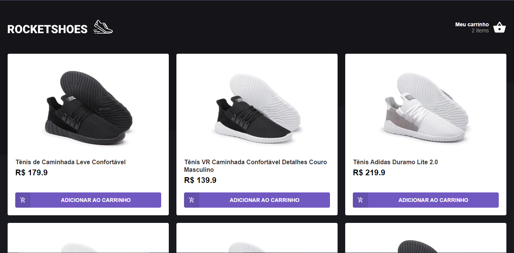
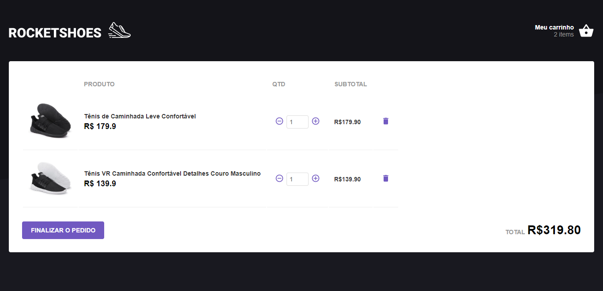

<h1>Rocketshoes</h1>

- Project using ReactJS and json-server.

<h1> Screenshots </h1>

<h2> Home Page </h2>

<h2> Cart </h2>

<h2> How to run the project </h2>

To start the project install json-server. https://github.com/typicode/json-server

Then start the server: json-server server.json -p 3333

Now launch the app Reactjs: yarn start